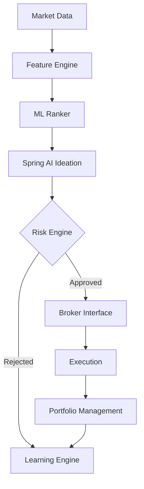

# SMART TRADER

SMART TRADER is an autonomous algorithmic trading platform designed around the principle that AI can suggest, but the **Risk Engine decides**. It uses Spring AI for intelligent decision-making, while keeping hard bounds and limits controlled by deterministic logic.

## Key Capabilities
- **Autonomous Trading**: Continuously monitors the market, detects regimes, and executes trades without human intervention.
- **Multi-factor ML Pipeline**: Ranks stocks based on 25 distinct features (fundamentals, technicals, macro).
- **Spring AI Integration**: Uses structured output and tool-calling (MarketDataTool) for trade ideation.
- **Strict Risk Engine**: Evaluates every order against 12 strict rules. AI *cannot* bypass this.
- **Continuous Learning**: Analyzes past trades, categorizes mistakes (26 types), and adapts parameters safely.

## Architecture Overview



## Tech Stack
| Component | Technology |
|---|---|
| Language | Java 25 |
| Framework | Spring Boot 4.1.1 |
| AI Integration | Spring AI 2.0.1 |
| Database | PostgreSQL 16 |
| Caching | Redis 7 |
| Build Tool | Gradle |

## Quick Start
Using Docker Compose is the easiest way to start SMART TRADER.

```bash
git clone https://github.com/your-org/smart-trader.git
cd smart-trader
cp .env.example .env
# Edit .env to add your OPENAI_API_KEY and BROKER credentials
docker-compose up -d
```

## Configuration (Environment Variables)
See `application.yml` and `.env.example`. Key properties:
- `TRADING_MODE`: Sets the mode (PAPER, LIVE, BACKTEST)
- `LIVE_TRADING_ENABLED`: Boolean flag. Must be true for LIVE mode.
- `OPENAI_API_KEY`: Key for Spring AI integration.
- `JWT_SECRET`: 256-bit secret for securing APIs.

## Trading Modes
1. **PAPER (Default)**: Simulated trading using real market data but fake execution.
2. **LIVE**: Connects to the real broker API. Fails to start if `LIVE_TRADING_ENABLED` is false.
3. **BACKTEST**: Runs historical simulations without external API calls for broker/market data.

## Safety Controls
- **Risk Engine**: 12 checks (e.g., max position size, max drawdown). AI output is treated as a request, not a command.
- **Kill Switch**: Shuts down trading and liquidates positions immediately if activated.

## API Endpoints Overview
- `POST /api/auth/login`: Authenticate and get JWT.
- `GET /api/portfolio`: View current holdings.
- `POST /api/system/kill-switch`: Activate the emergency kill switch.
(See API.md for more details).

## Development Setup
Requires Java 25.
```bash
./gradlew bootRun
```

## Testing
Run all tests including Risk Engine unit tests:
```bash
./gradlew test
```
